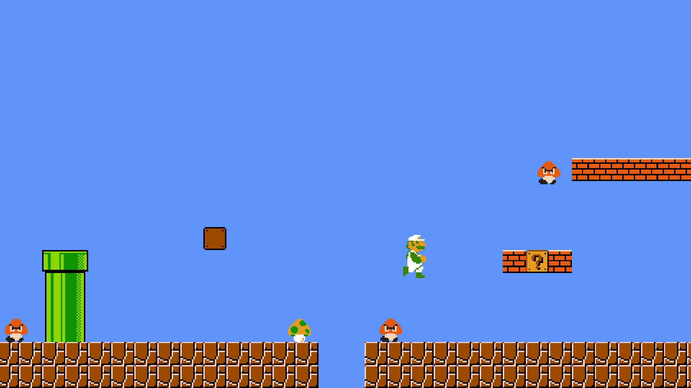

# Luigi 1 - 1

---

### *The first level of Mario Bros without Mario !*

---

## Controls :

- **Arrows** : Movement + Jump

- **Space** : Action button (fireball)

- **R** : Reset the game

---

## Features :

- A playable charcter handled by a kinematic body

- Entity (custom) tilemap

- Provides an audio system

- Entity spawn system

- Physics layers

- All assets are included in src/*

- Fun !

---

## Notes :

- This game is inspired by this repo by Justin Meister : [Mario Level 1](https://github.com/justinmeister/Mario-Level-1 "Mario Level 1"), many assets come from here.

- Like this repo, this project is intended for non-commercial educational purposes.

- This project is not completed but is still on GitHub for education and fun.

- I have made this project to discover Godot, the game works but may be more optimized and also much more code-designed.
